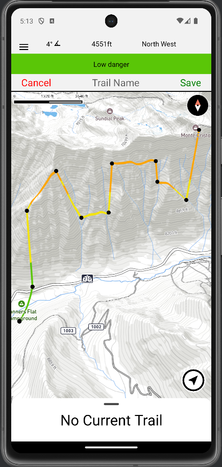

- 👋 Hi, I’m @MikeWelsh801. I'm a CS student at the University of Utah.
- 👀 I’m interested in computer security and networking, code challenges (AoC), CTF, machine learning, basketball (I like stats analytics but also just watching games), and snowboarding.
- 🌱 I’m currently taking Algorithms, Operating Systems, Mobile App Programming, and Senior Capstone Project.
- 🏂 Co-creator of the [AvyViz](https://github.com/MikeWelsh801/avyviz) avalanche safety app. Avyviz provides offline trail creation for downloaded maps with color coded trail danger based on Utah Avalanche Center forecasts (see below).
- 📫 How to reach me -- mikewelsh801@gmail.com

# AvyViz

<!---
MikeWelsh801/MikeWelsh801 is a ✨ special ✨ repository because its `README.md` (this file) appears on your GitHub profile.
You can click the Preview link to take a look at your changes.
--->
